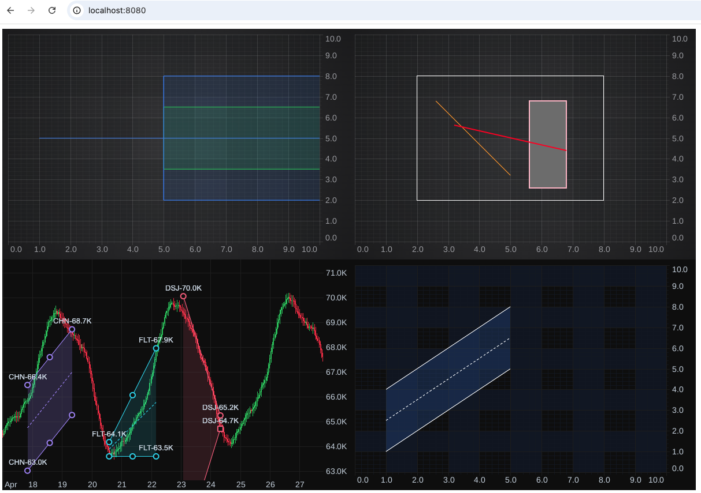

# fin-tools-demo

Standalone SciChart.js example pinned to `scichart@5.1.9` (registry: `myget`).

## Run

    npm install
    npm start

Then open http://localhost:8080.

## Build

    npm run build
